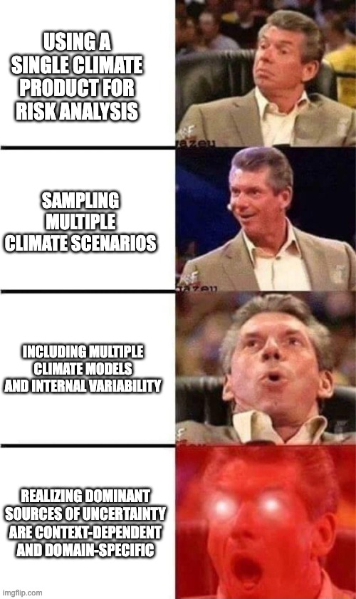

## Links

* [Code Repository](https://github.com/david0811/conus_comparison_lafferty-etal-2026)
* [Preprint](https://essopenarchive.org/doi/full/10.22541/essoar.15003332/v1)

## Abstract

Long-term projections of climate and weather extremes are highly uncertain owing to several factors related to modeling the Earth system at high resolution. Understanding the relative importance of these factors can better inform communities and planners and help mitigate future risks. We combine three sets of high-resolution climate simulations covering the continental United States to estimate the contribution of different uncertainty sources in projections of temperature and precipitation. We find that the dominant source of uncertainty changes across variables and depends on the metric of interest —- for example, whether the metric reflects average or extreme conditions. Temperature projections are most sensitive to assumptions around future greenhouse gas emissions, as well as the Earth system model used for simulations. In contrast, precipitation metrics are often dominated by internal variability -— the irreducible randomness of the climate system. For understanding changes to rare events that occur every 50 years or longer, statistical methods used to estimate their frequency can introduce more uncertainty than the climate science itself. Our findings show that no single source of uncertainty is universally dominant, and prudent climate risk assessment requires carefully accounting for all statistical and physical sources of uncertainty.

## Meme

{width=60%}
