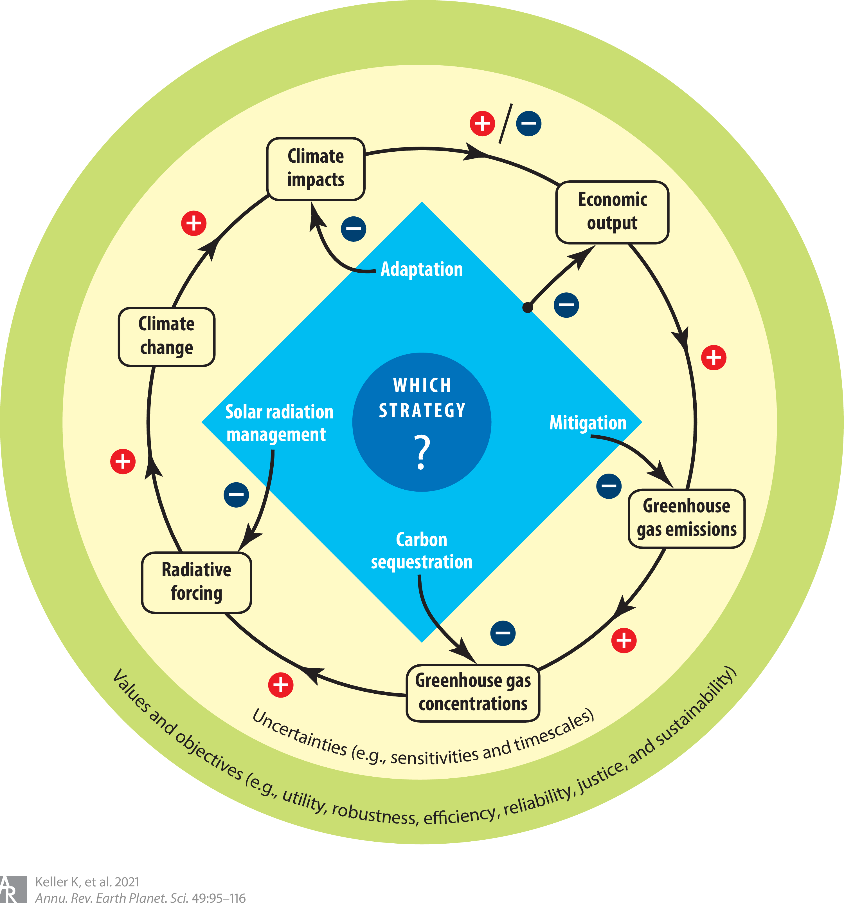

{width=50% fig-align="center"}

Future climate risks are challenging to quantify due to their dependence on uncertain greenhouse gas emissions and Earth-system dynamics. These uncertainties interact, and their relative importance is not fixed: which sources dominate depends on the time horizon, the region, and the risk metric of interest.

We work on characterizing how risks such as sea-level rise and water shortages respond to socioeconomic changes (such as emissions pathways and economic growth) and their interactions with Earth-system uncertainties. This work relies on models which are simple and fast enough to calibrate against observations and to sample thoroughly, and on being explicit about structural modeling choices as well as parametric ones.

## Selected Publications

:::{#pubs}
:::
