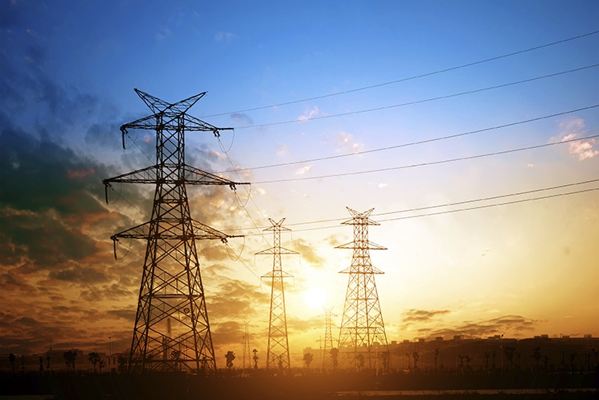

{width=50% fig-align="center"}

The relationship between the electric power system and environmental change is becoming more complex as energy systems continue to decarbonize and the broader economy is electrified. Future changes to environmental risks such as heat waves and flooding can reduce grid reliability while increasing demand. In addition to the natural variability of solar and wind resources, hydroclimatic variability may result in a weakening of hydropower as a zero-emissions generation source over decadal time scales. And California has seen blackouts resulting from attempts to manage wildfire risks by power utilities.

As fuel costs and emissions constraints become less binding, weather and technology uncertainties become correspondingly more important for reliability planning. We investigate the impact of these mechanisms under deep climate uncertainty for today's decisions about energy system infrastructure investments. We quantify how climate variability and future climate changes impact power system reliability, and work on identifying where these systems are most likely to fail, to understand how the power grid can be hardened to reduce outages.

## Selected Publications

:::{#pubs}
:::
