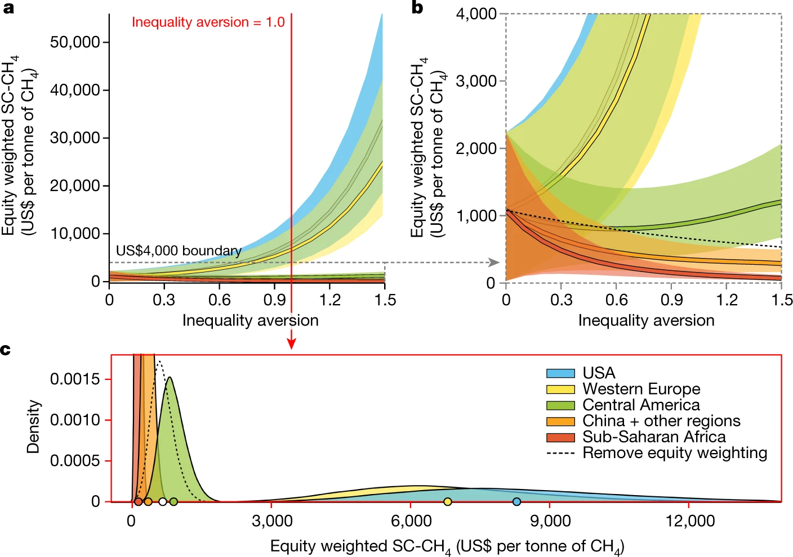

{width=50% fig-align="center"}

Estimating the damages associated with a unit of emissions requires a chain of modeling choices, including atmospheric chemistry, damage functions, discount rates, and how damages to different populations are aggregated. Some of these choices matter more than the geophysical uncertainties they are typically reported alongside, and several climate-relevant gases have no published estimates at all.

We work on quantifying the economic impacts of emissions and of the decisions made to reduce them. This includes estimating the social costs of greenhouse gases, extending simple climate models where the relevant processes are not yet represented, and identifying where mitigation yields near-term air quality and health benefits.

## Selected Publications

:::{#pubs}
:::
